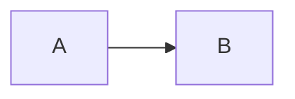

# Maryam Library — règles de rendu Markdown

Ce document définit les invariants de syntaxe à respecter dans tous les contenus académiques de Maryam Library.

Objectif : empêcher qu'un contenu correct sur le fond casse visuellement dans Astro/Starlight à cause d'un mélange fragile entre Markdown, HTML, LaTeX et Mermaid.

## 1. Principe général

Le Markdown académique doit rester simple, prévisible et testable.

Avant d'ajouter une syntaxe spéciale, préférer dans cet ordre :

1. Markdown standard ;
2. LaTeX via `$...$` ou `$$...$$` ;
3. blocs `academic-block` déjà supportés ;
4. Mermaid uniquement pour une vraie vue d'ensemble ;
5. HTML brut uniquement pour les composants déjà documentés.

Ne pas inventer de nouvelle convention locale dans un cours.

## 2. Mathématiques

### Inline

Utiliser :

```md
La complexité est $\Theta(n\log n)$.
```

Ne pas utiliser `\(...\)`.

### Display

Utiliser :

```md
$$
A=LU.
$$
```

Règles :

- `$$` seul sur sa ligne ;
- formule seule entre les deux délimiteurs ;
- ligne vide avant et après le bloc ;
- ne pas indenter un bloc display dans une liste ;
- ne jamais remplacer un display par un simple `$` isolé sur une ligne ;
- ne pas utiliser `\[ ... \]` comme délimiteurs de display.

Dans une liste numérotée, garder la formule hors du niveau d'indentation :

```md
1. Choisir le pivot :

$$
p=\arg\max_i |a_i|.
$$

2. Éliminer.
```

### LaTeX dans les tableaux

Les maths inline simples sont autorisées dans les cellules.

Éviter dans une cellule :

- `$$...$$` ;
- `\begin{aligned}` ;
- `\begin{cases}` ;
- les expressions multilignes.

Si une formule est longue, la sortir du tableau.

## 3. Code

Toujours utiliser de vraies fences Markdown :

````md
```python
print("ok")
```
````

Interdit :

```text
\`\`\`python
...
\`\`\`
```

Les backticks d'une fence ne doivent jamais être échappés.

Langages autorisés selon le contenu : `c`, `java`, `python`, `bash`, `text`, `mermaid`.

## 4. Blocs pédagogiques

Syntaxe canonique :

```md
<div class="academic-block academic-block--definition">
<p class="academic-block__title">Définition</p>

Texte en Markdown et mathématiques $G=(V,E)$.

</div>
```

Règles :

- ligne vide avant le contenu Markdown ;
- ligne vide avant `</div>` ;
- ne pas imbriquer un `academic-block` dans un autre ;
- les titres `##` et `###` restent hors du bloc ;
- ne pas placer de fence de code ou de Mermaid dans un bloc HTML sauf si le rendu a été vérifié explicitement.

## 5. Mermaid

Syntaxe :

````md

````

Règles :

- utiliser Mermaid pour une structure globale, pas pour remplacer du texte simple ;
- préférer des labels courts ;
- éviter le LaTeX complexe dans les labels Mermaid ;
- ne jamais échapper les backticks de la fence ;
- un diagramme doit rester lisible sur mobile.

## 6. Tableaux

Les tableaux doivent rester courts et scannables.

Règles :

- pas de paragraphe long dans une cellule ;
- pas de formule display dans une cellule ;
- pas de HTML complexe dans une cellule ;
- si le tableau devient trop large, préférer des sous-sections ou une liste structurée ;
- vérifier le débordement horizontal sur mobile.

## 7. Exercices et ancres

Format canonique :

```md
<span id="tp1-exercice-2" aria-hidden="true"></span>

## TP1 — Exercice 2

<a class="exercise-action" href="#correction-tp1-exercice-2">Voir la correction <span aria-hidden="true">↓</span></a>
```

Puis plus bas :

```md
<span id="correction-tp1-exercice-2" aria-hidden="true"></span>

### Correction — TP1, exercice 2

...

<a class="exercise-action" href="#tp1-exercice-2">Retour à l’exercice <span aria-hidden="true">↑</span></a>
```

Règles :

- identifiants en minuscules ASCII avec tirets ;
- une ancre unique par exercice et correction ;
- correction hors `<details>` dans `exercices.md` ;
- conserver les liens aller/retour lors d'une édition.

## 8. Blocs details

`<details>` est réservé aux contenus secondaires, par exemple une correction d'examen ou un sommaire repliable.

Ne pas l'utiliser autour :

- d'une correction d'exercice sélectionné ;
- d'une formule essentielle ;
- d'une définition ou méthode nécessaire à la lecture principale.

Toujours garder une ligne vide après `<summary>` et avant `</details>`.

## 9. Titres

- un seul H1 généré par Starlight/frontmatter : ne pas ajouter de `# ...` dans le corps ;
- commencer le contenu au niveau `##` ;
- respecter l'ordre `## → ### → ####` ;
- éviter de sauter directement de `##` à `####`.

## 10. Patterns interdits

Ne jamais committer dans un document académique :

- fences échappées `\`\`\`` ;
- délimiteurs LaTeX `\(...\)` ou `\[...\]` utilisés comme délimiteurs de bloc ;
- ligne contenant uniquement `$` pour simuler un bloc display ;
- HTML custom non documenté ;
- corrections d'exercices dans `<details>` ;
- formules display dans une cellule de tableau ;
- balises HTML non fermées.

## 11. Checklist avant commit

Pour chaque document modifié :

1. frontmatter intact ;
2. titres hiérarchiques cohérents ;
3. fences de code correctement ouvertes/fermées ;
4. nombres pairs de `$$` ;
5. pas de fence échappée ;
6. pas de LaTeX display indenté dans une liste ;
7. ancres d'exercices uniques ;
8. blocs `academic-block` fermés ;
9. Mermaid rendu et lisible ;
10. rendu desktop + mobile sans débordement global.

Après modification du contenu, lancer au minimum :

```bash
npm run build
npm run test:render
git diff --check
```

Si une modification touche la configuration ou les composants, lancer aussi :

```bash
npm run check
```
