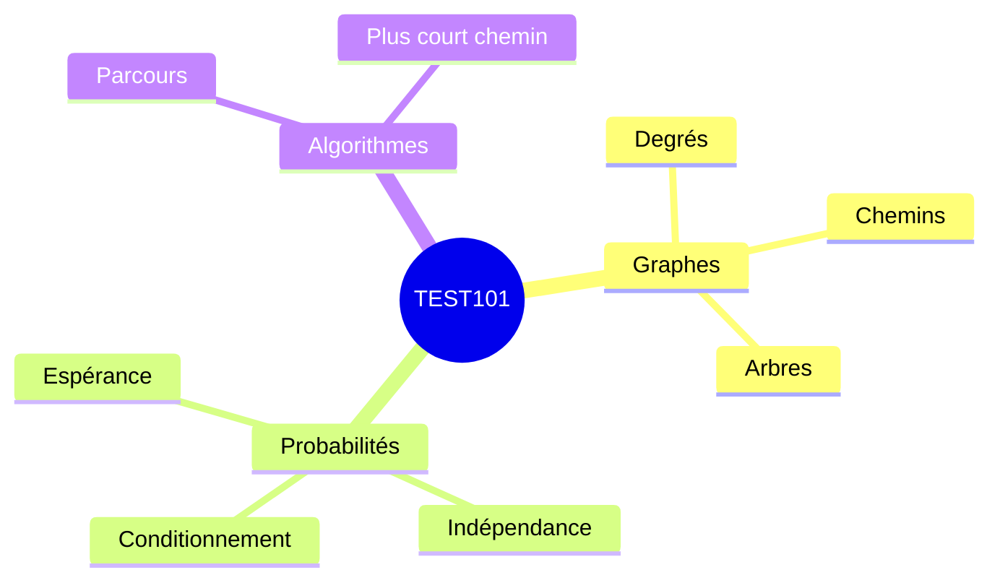

Ce document fictif sert à tester une synthèse dense : mathématiques inline et display, diagramme Mermaid, tableau, code et contenu repliable.

## Carte des notions



<div class="academic-block academic-block--memorize">
<p class="academic-block__title">À retenir</p>

Le modèle décrit les objets, les formules relient leurs propriétés et l’algorithme fournit une procédure calculable.

</div>

## Graphes

<div class="academic-block academic-block--definition">
<p class="academic-block__title">Définition</p>

Un graphe non orienté est un couple $G=(V,E)$, où $V$ est l’ensemble des sommets et $E\subseteq\{\{u,v\}:u,v\in V\}$ l’ensemble des arêtes.

</div>

### Lemme des poignées de main

<div class="academic-block academic-block--theorem">
<p class="academic-block__title">Théorème — Lemme des poignées de main</p>

Pour tout graphe fini non orienté,

$$
\sum_{v\in V}\deg(v)=2|E|.
$$

Chaque arête contribue exactement deux fois à la somme des degrés.

</div>

### Arbres

Pour un graphe fini $T=(V,E)$, les propriétés suivantes sont équivalentes :

| Propriété | Lecture rapide |
|---|---|
| $T$ est connexe et sans cycle | Définition structurelle |
| Il existe un unique chemin entre deux sommets | Caractérisation par les chemins |
| $T$ est connexe et $\lvert E\rvert=\lvert V\rvert-1$ | Test par comptage |

<div class="academic-block academic-block--pitfall">
<p class="academic-block__title">Piège</p>

L’égalité $|E|=|V|-1$ ne suffit pas seule : un graphe peut être non connexe et contenir un cycle.

</div>

## Probabilités

<div class="academic-block academic-block--memorize">
<p class="academic-block__title">Formule clé</p>

Soient $A$ et $B$ deux événements avec $P(B)>0$. La probabilité conditionnelle est

$$
P(A\mid B)=\frac{P(A\cap B)}{P(B)}.
$$

</div>

La formule de Bayes s’écrit

$$
P(A_i\mid B)
=
\frac{P(B\mid A_i)P(A_i)}
{\sum_{j=1}^{n}P(B\mid A_j)P(A_j)},
$$

lorsque $(A_1,\ldots,A_n)$ forme une partition et que $P(B)>0$.

### Espérance et variance

Pour une variable aléatoire discrète $X$,

$$
\begin{aligned}
\mathbb{E}[X] &= \sum_x x\,P(X=x),\\
\operatorname{Var}(X) &= \mathbb{E}[X^2]-\mathbb{E}[X]^2.
\end{aligned}
$$

La linéarité de l’espérance ne demande pas l’indépendance :

$$
\mathbb{E}\!\left[\sum_{i=1}^{n}X_i\right]
=
\sum_{i=1}^{n}\mathbb{E}[X_i].
$$

## Algorithme

<div class="academic-block academic-block--example">
<p class="academic-block__title">Exemple — Parcours en largeur</p>

Exemple court destiné à vérifier la coloration syntaxique et le débordement horizontal sur mobile :

```java
Queue<Integer> queue = new ArrayDeque<>();
boolean[] visited = new boolean[n];

visited[source] = true;
queue.add(source);

while (!queue.isEmpty()) {
    int u = queue.remove();
    for (int v : adjacencyList.get(u)) {
        if (!visited[v]) {
            visited[v] = true;
            queue.add(v);
        }
    }
}
```

La complexité d’un parcours en largeur avec listes d’adjacence est $O(|V|+|E|)$.

</div>

## Pièges fréquents

<div class="academic-block academic-block--pitfall">
<p class="academic-block__title">Piège</p>

Confondre $P(A\mid B)$ avec $P(B\mid A)$.

</div>

<div class="academic-block academic-block--pitfall">
<p class="academic-block__title">Piège</p>

Utiliser Dijkstra lorsqu’une arête possède un poids négatif.

</div>

<div class="academic-block academic-block--method">
<p class="academic-block__title">Méthode</p>

Avant d’appliquer un résultat, identifier les hypothèses, écrire la formule symbolique, puis seulement remplacer par les valeurs.

</div>
